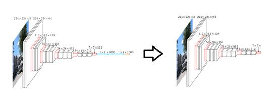
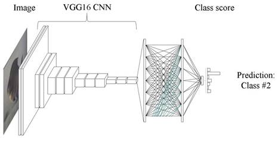

#Using deep learning to classify Melanoma
#========================================
#
#skiaie@cloudera.com
#-------------------
#
# 
#  
# 
#  
#
###Goal
#----
#
#**To build a classifier that can  
#  
#1) take an image of skin  
#  
#2) determine whether the patient needs critical attention form a physician.  
#  
#  
  
#  
#  
#
#!(/home/cdsw/1_introduction/images/inception_v3.jpg)
#
#  
#  
#  
#We will use a Convolutional Neural Network  
#  
#The architecture we will use is the VGG 16 architecture  
#  
#  
#  
#
#VGG 16
#------
#
#  
#  
#
#  
#  
#  
#  
#  
#
#1) Strip the top layers of the network off
#------------------------------------------
#
#  
#  
#  
#
#  
#  
#  
#  
#  
#
#2) Train a classifier on top of the remaining convolutional layers
#------------------------------------------------------------------
#
#  
#  
#  
#
#
#
#3) Plug the classifier back onto the convolutional layers, and retrain the whole model
#--------------------------------------------------------------------------------------
#
