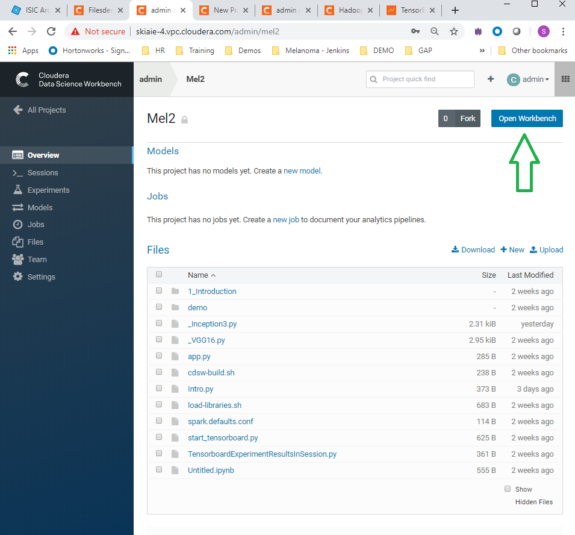
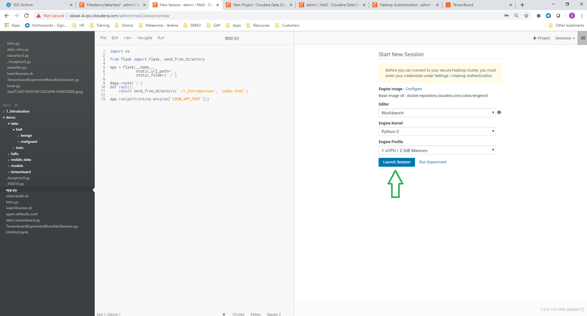

# Deep Learning In Medicine CDSW Demo 

[skiaie@cloudera.com](mailto:skiaie@cloudera.com)

### Demo Summary:

- Use Case:  Diagnosing Melanoma
- Broader Healthcare Applicability:
  - Disease diagnosis using medical images
    - radiology (arteriography, mammography, radiomics)
    - dermatology
    - oncology

- Broader Industry applicability
  - Biotech
  - Pharma
  - Semiconductor Fabrication

### Story

1. Take open source images of skin lesions, and use those to build a classifier to detect malignant skin lesions
2. Evaluate the performance of the model using TensorBoard, and matplotlib in CDSW
3. Deploy the model onto a mobile device for use in clinical settings
4. Use the mobile app to determine if a patient needs critical attention from a physician (Note: in the demo we use a model deployed on a mobile device, for simplicity.  I.e. inference happens on the edge, using a low latency, MobileNet model.  The more likely choice for this use case would be to perform classification in batch or perform the inference centrally, using a model with superior performance characteristics (measured by AUC).

 

<b>1.</b> 

	

<!-- downarrow -->
<h1> 
 &downarrow; 
 </h1>

<b>2.</b>

<!-- downarrow -->
<h1> 
 &downarrow; 
 </h1>

<b>3.</b>

	

<!-- downarrow -->
<h1> 
 &downarrow; 
 </h1>

<b>4.</b>

	

  

### The preliminary talk track videos are here:

- [Deck Talk Track](https://rebrand.ly/mpvdv4)
- [Demo Talk Track](https://rebrand.ly/4269co)

The talk tracks here were made for brevity, and to focus on the specifics of this use case, so some of the boilerplate CML messaging is missing (e.g. some of the collaborative features).  The standard positioning statements can be added.

### The deck is here:

- [De](https://rebrand.ly/nrdz1m)[ck](https://rebrand.ly/nrdz1m)

 

### Demo Setup

The setup takes 5 minutes

 

1. In CDSW Go to Projects, and create a New Project

 

 

2. Name the Project "Melanoma Classification", and in the initial setup use git repo: https://github.com/hortonworks-sk/CDSW-Melanoma2.git , and hit the create button

 

 

3. Launch a Python 3 workbench session

 

 

4. Navigate to the load-libraries.sh script, and run the script. This will load the libraries needed for the demo.

 

 

5. Stop the Python 3 workbench session, and open another Python 3 session. This is required for some of the libraries to be available.

 

 

6. Navigate to the start_tensorboard.py script, and run this.

 

 

7. Check that the Tensorboard link is displaying in CDSW and that tensorboard is running, by clicking the tensorboard link

 

 

8. Click on the tensorboard tabs for Scalars , Graph and the Histograms , to check that these are displaying correctly (each are shown in order below)

 

 

 

 

9. Navigate to experiments and click run experiment

 

 

10. Run experiments for the **_Inception3.py , and ** _VGG16.py**, scripts.  Use the python 3 kernel. No need to supply arguments for these. 

 

 

